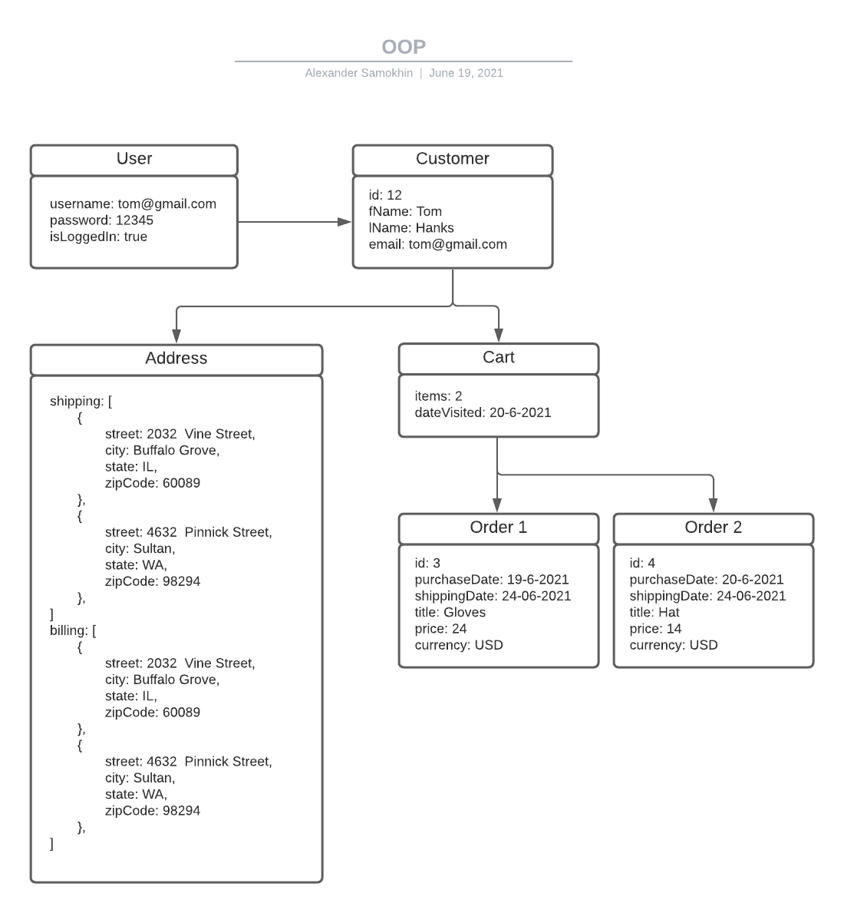

## Homework Assignment #12: Object Oriented Programming.

### What is object oriented programming?
Object-oriented programming (OOP) is a computer programming model that organizes software design around data, or objects, rather than functions and logic. An object can be defined as a data field that has unique attributes and behavior.

### Why would you use it?
OOP is a programming paradigm that allows you to package together data states and functionality to modify those data states, while keeping the details hidden away. As a result, code with OOP design is flexible, modular, and abstract. This makes it particularly useful when you create larger programs. Additional benefits of OOP include code reusability, scalability and efficiency. 

### In which cases would an OOP pattern be a better choice?
OOP pattern is suitable when application has to perform CRUD functionalities. Specially, use of OOP pattern to pass data back and forth between front-end application and back-end scripts. This helps to maintain modularity of the code and allows to identify which of data interacts with the application.

### eCommerce Store Website
The purpose of the application is to give users an easy way to purchase products online. Users can browse items in a catalog, create account, add products to a shopping cart and edit their account details.

### User Stories

#### Index.
Upon a fresh load of the application, the user should see the shop catalog where they can search and browse items. The user can add products to a shopping cart. The user can create an account or login in the existing account and preview his/her orders. The user can edit or delete his/her account. 

#### Sign Up / Login
If "Sign Up" is clicked, the user should be taken to a form where they need to enter their: username and password. If "Login clicked" is clicked the user should be taken to a form where they need to enter their username and password.

#### My Account
- User can create his/her account
- User can view his/her account
- User can edit his/her account
- User can delete his/her account

#### Cart
- User can add product to a shopping cart
- User can view product in a shopping cart
- User can delete product from a shopping cart
- User can edit order in a shopping cart

### Representation of OOP Objects as a diagram

